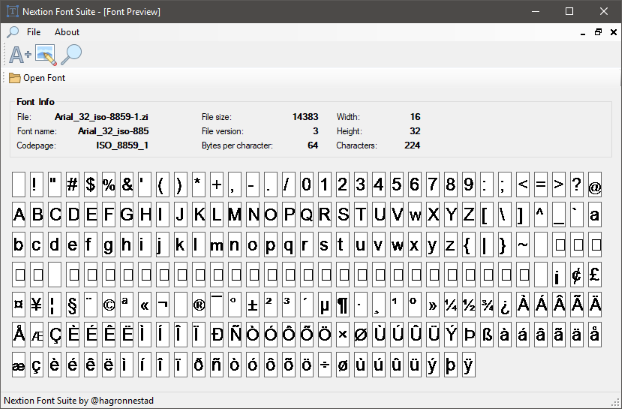

# Nextion Font Editor

> Sample screenshot of the "Font Editor"-tool previewing the `$` character from the `Arial_40_ascii.zi` file.

> Sample screenshot of the "Font Preview"-tool previewing the `Arial_40_ascii.zi` file.

## Nextion .ZI Font Format Specification

This project is based on my reverse engineered specification of the Nextion font format. Which can be found here: [Nextion Font Format Specification](Docs/Nextion%20Font%20Format%20Specification.md).